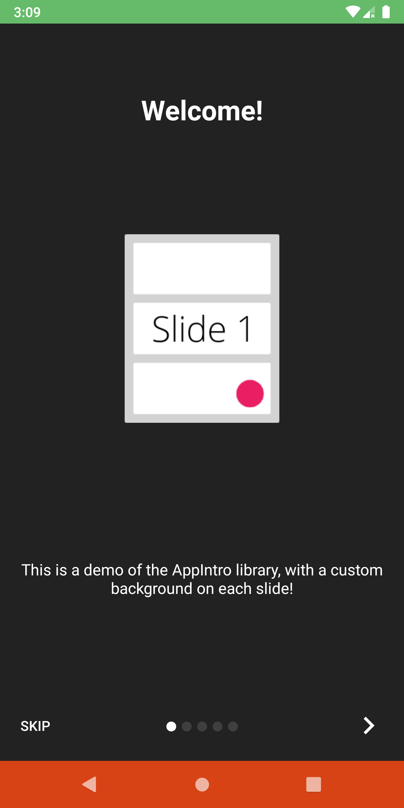
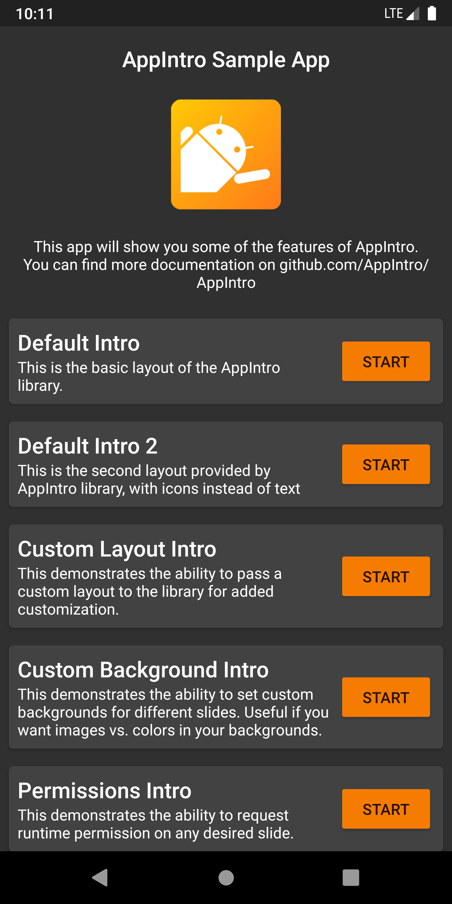

# AppIntro

[](https://jitpack.io/#AppIntro/appintro) [](https://kotlinlang.slack.com/archives/C019SH1RMBN) [](https://github.com/AppIntro/AppIntro/actions?query=workflow%3A%22Pre+Merge+Checks%22) [](https://android-arsenal.com/details/1/1939) [](https://github.com/KotlinBy/awesome-kotlin)

AppIntro is an Android Library that helps you build a **cool carousel intro** for your App. AppIntro has support for **requesting permissions** and helps you create a great onboarding experience in just a couple of minutes.

<p align="center">
     
</p>
   
  * [Getting Started <g-emoji class="g-emoji" alias="footprints" fallback-src="https://github.githubassets.com/images/icons/emoji/unicode/1f463.png">👣</g-emoji>](#getting-started-)
     * [Adding a dependency](#adding-a-dependency)
     * [Basic usage](#basic-usage)
     * [Java users](#java-users)
  * [Migrating <g-emoji class="g-emoji" alias="car" fallback-src="https://github.githubassets.com/images/icons/emoji/unicode/1f697.png">🚗</g-emoji>](#migrating-)
  * [Features <g-emoji class="g-emoji" alias="toolbox" fallback-src="https://github.githubassets.com/images/icons/emoji/unicode/1f9f0.png">🧰</g-emoji>](#features-)
  * [Creating Slides <g-emoji class="g-emoji" alias="woman_artist" fallback-src="https://github.githubassets.com/images/icons/emoji/unicode/1f469-1f3a8.png">👩‍🎨</g-emoji>](#creating-slides-)
     * [AppIntroFragment](#appintrofragment)
     * [AppIntroCustomLayoutFragment](#appintrocustomlayoutfragment)
  * [Configure <g-emoji class="g-emoji" alias="art" fallback-src="https://github.githubassets.com/images/icons/emoji/unicode/1f3a8.png">🎨</g-emoji>](#configure-)
     * [Slide Transformer](#slide-transformer)
        * [Custom Slide Transformer](#custom-slide-transformer)
     * [Color Transition](#color-transition)
     * [Multiple Windows Layout](#multiple-windows-layout)
     * [Indicators](#indicators)
     * [Vibration](#vibration)
     * [Wizard Mode](#wizard-mode)
     * [Immersive Mode](#immersive-mode)
     * [System Back button](#system-back-button)
     * [System UI (Status Bar and Navigation Bar)](#system-ui-status-bar-and-navigation-bar)
  * [Permission <g-emoji class="g-emoji" alias="lock" fallback-src="https://github.githubassets.com/images/icons/emoji/unicode/1f512.png">🔒</g-emoji>](#permission-)
     * [Slide Policy](#slide-policy)
  * [Example App <g-emoji class="g-emoji" alias="bulb" fallback-src="https://github.githubassets.com/images/icons/emoji/unicode/1f4a1.png">💡</g-emoji>](#example-app-)
  * [Translating <g-emoji class="g-emoji" alias="earth_africa" fallback-src="https://github.githubassets.com/images/icons/emoji/unicode/1f30d.png">🌍</g-emoji>](#translating-)
  * [Snapshots <g-emoji class="g-emoji" alias="package" fallback-src="https://github.githubassets.com/images/icons/emoji/unicode/1f4e6.png">📦</g-emoji>](#snapshots-)
  * [Contributing <g-emoji class="g-emoji" alias="handshake" fallback-src="https://github.githubassets.com/images/icons/emoji/unicode/1f91d.png">🤝</g-emoji>](#contributing-)
  * [Acknowledgments <g-emoji class="g-emoji" alias="cherry_blossom" fallback-src="https://github.githubassets.com/images/icons/emoji/unicode/1f338.png">🌸</g-emoji>](#acknowledgments-)
     * [Maintainers](#maintainers)
     * [Libraries](#libraries)
  * [License <g-emoji class="g-emoji" alias="page_facing_up" fallback-src="https://github.githubassets.com/images/icons/emoji/unicode/1f4c4.png">📄</g-emoji>](#license-)
  * [Apps using AppIntro <g-emoji class="g-emoji" alias="iphone" fallback-src="https://github.githubassets.com/images/icons/emoji/unicode/1f4f1.png">📱</g-emoji>](#apps-using-appintro-)


## Getting Started 👣

AppIntro is distributed through [JitPack](https://jitpack.io/#AppIntro/AppIntro).

### Adding a dependency

To use it you need to add the following gradle dependency to your `build.gradle` file of the module where you want to use AppIntro (NOT the root file).

```groovy
repositories {
    maven { url "https://jitpack.io" }
}
```

```groovy
dependencies {
    // AndroidX Capable version
    implementation 'com.github.AppIntro:AppIntro:6.2.0'
    
    // *** OR ***
    
    // Latest version compatible with the old Support Library
    implementation 'com.github.AppIntro:AppIntro:4.2.3'
}
```

Please note that since AppIntro 5.x, the library supports [Android X](https://developer.android.com/jetpack/androidx/). If you haven't migrated yet, you probably want to use a previous version of the library that uses the **old Support Library** packages (or try [Jetifier Reverse mode](https://ncorti.com/blog/jetifier-reverse)).

### Basic usage

To use AppIntro, you simply have to create a new **Activity that extends AppIntro** like the following:

```kotlin
class MyCustomAppIntro : AppIntro() {
    override fun onCreate(savedInstanceState: Bundle?) {
        super.onCreate(savedInstanceState)
        // Make sure you don't call setContentView!

        // Call addSlide passing your Fragments.
        // You can use AppIntroFragment to use a pre-built fragment
        addSlide(AppIntroFragment.createInstance(
                title = "Welcome...",
                description = "This is the first slide of the example"
        ))
        addSlide(AppIntroFragment.createInstance(
                title = "...Let's get started!",
                description = "This is the last slide, I won't annoy you more :)"
        ))
    }

    override fun onSkipPressed(currentFragment: Fragment?) {
        super.onSkipPressed(currentFragment)
        // Decide what to do when the user clicks on "Skip"
        finish()
    }

    override fun onDonePressed(currentFragment: Fragment?) {
        super.onDonePressed(currentFragment)
        // Decide what to do when the user clicks on "Done"
        finish()
    }
}
```

Please note that you **must NOT call** setContentView. The `AppIntro` superclass is taking care of it for you.

Also confirm that you're overriding `onCreate` with **a single parameter** (`Bundle`) and you're not using another override (like `onCreate(Bundle, PersistableBundle)`) instead.

Finally, declare the activity in your Manifest like so:

``` xml
<activity android:name="com.example.MyCustomAppIntro"
    android:label="My Custom AppIntro" />
```

We suggest to don't declare `MyCustomAppIntro` as your first Activity unless you want the intro to launch every time your app starts. Ideally you should show the AppIntro activity only once to the user, and you should hide it once completed (you can use a flag in the `SharedPreferences`).

### Java users

You can find many examples in java language in the [examples directory](example/src/main/java/com/github/appintro/example/ui/java/JavaIntro.java)

## Migrating 🚗

If you're migrating **from AppIntro v5.x to v6.x**, please expect multiple breaking changes. You can find documentation on how to update your code on this other [migration guide](/docs/migrating-from-5.0.md).

## Features 🧰

Don't forget to check the [changelog](CHANGELOG.md) to have a look at all the changes in the latest version of AppIntro.

* **API >= 14** compatible.
* 100% Kotlin Library.
* **AndroidX** Compatible.
* Support for **runtime permissions**.
* Dependent only on AndroidX AppCompat/Annotations, ConstraintLayout and Kotlin JDK.
* Full RTL support.

## Creating Slides 👩‍🎨

The entry point to add a new slide is the `addSlide(fragment: Fragment)` function on the `AppIntro` class.
You can easily use it to add a new `Fragment` to the carousel.

The library comes with several util classes to help you create your Slide with just a couple lines:

### `AppIntroFragment`

You can use the `AppIntroFragment` if you just want to customize title, description, image and colors.
That's the suggested approach if you want to create a quick intro:

```kotlin
addSlide(AppIntroFragment.createInstance(
    title = "The title of your slide",
    description = "A description that will be shown on the bottom",
    imageDrawable = R.drawable.the_central_icon,
    backgroundDrawable = R.drawable.the_background_image,
    titleColorRes = R.color.yellow,
    descriptionColorRes = R.color.red,
    backgroundColorRes = R.color.blue,
    titleTypefaceFontRes = R.font.opensans_regular,
    descriptionTypefaceFontRes = R.font.opensans_regular,
))
```

All the parameters are optional, so you're free to customize your slide as you wish.

If you need to programmatically create several slides you can also use the `SliderPage` class.
This class can be passed to `AppIntroFragment.createInstance(sliderPage: SliderPage)` that will create
a new slide starting from that instance.

### `AppIntroCustomLayoutFragment`

If you need further control on the customization of your slide, you can use the `AppIntroCustomLayoutFragment`.
This will allow you pass your custom Layout Resource file:

```kotlin
AppIntroCustomLayoutFragment.newInstance(R.layout.intro_custom_layout1)
```

This allows you to achieve complex layout and include your custom logic in the Intro (see also [Slide Policy](#slide-policy)):

<p align="center">
    
</p>

## Configure 🎨

AppIntro offers several configuration option to help you customize your onboarding experience.

### Slide Transformer

AppIntro comes with a set of _Slide Transformer_ that you can use out of the box to animate your Slide transition.

| Slide Transformers | Slide Transformers |
| :---: | :---: |
| Fade<br/> | Zoom<br/> |
| Flow<br/> | Slide Over<br/> |
| Depth<br/> | Parallax<br/> |

You can simply call `setTransformer()` and pass one of the subclass of the sealed class `AppIntroPageTransformerType`: 

```kotlin
setTransformer(AppIntroPageTransformerType.Fade)
setTransformer(AppIntroPageTransformerType.Zoom)
setTransformer(AppIntroPageTransformerType.Flow)
setTransformer(AppIntroPageTransformerType.SlideOver)
setTransformer(AppIntroPageTransformerType.Depth)

// You can customize your parallax parameters in the constructors. 
setTransformer(AppIntroPageTransformerType.Parallax(
                titleParallaxFactor = 1.0,
                imageParallaxFactor = -1.0,
                descriptionParallaxFactor = 2.0
))
```

#### Custom Slide Transformer

You can also provide your custom Slide Transformer (implementing the `ViewPager.PageTransformer` interface) with:

```kotlin
setCustomTransformer(ViewPager.PageTransformer)
```

### Color Transition

<p align="center">
    
</p>

AppIntro offers the possibility to animate the **color transition** between two slides background.
This feature is disabled by default, and you need to enable it on your AppIntro with:

```kotlin
isColorTransitionsEnabled = true
```

Once you enable it, the color will be animated between slides with a gradient.
Make sure you provide a `backgroundColor` parameter in your slides.

If you're providing custom Fragments, you can let them support the color transition by implementing
the `SlideBackgroundColorHolder` interface.

### Multiple Windows Layout

AppIntro is shipped with two top-level layouts that you can use.
The default layout (`AppIntro`) has textual buttons, while the alternative
layout has buttons with icons.

To change the Window layout, you can simply change your superclass to `AppIntro2`.
The methods to add and customize the AppIntro are unchanged.

```kotlin
class MyCustomAppIntro : AppIntro2() {
    // Same code as displayed in the `Basic Usage` section of this README
}
```

| Page | `AppIntro` | `AppIntro2` |
| ---: | :--------: | :---------: |
| standard page |  |  |
| last page |  |  |

### Indicators

AppIntro supports two indicators out of the box to show the progress of the Intro experience to the user:

* `DotIndicatorController` represented with a list of Dot (the default)
* `ProgressIndicatorController` represented with a progress bar.

| `DotIndicator` | `ProgressIndicator` |
| ---------- | ----------- |
|  |  |

Moreover, you can supply your own indicator by providing an implementation of the `IndicatorController` interface.

You can customize the indicator with the following API on the `AppIntro` class:

```kotlin
// Toggle Indicator Visibility                
isIndicatorEnabled = true

// Change Indicator Color 
setIndicatorColor(
    selectedIndicatorColor = getColor(R.color.red),
    unselectedIndicatorColor = getColor(R.color.blue)
)

// Switch from Dotted Indicator to Progress Indicator
setProgressIndicator()

// Supply your custom `IndicatorController` implementation
indicatorController = MyCustomIndicator(/* initialize me */)
```

If you don't specify any customization, a `DotIndicatorController` will be shown.

### Vibration

AppIntro supports providing haptic _vibration_ feedback on button clicks. 
Please note that you **need to specify the Vibration permission** in your app Manifest 
(the library is not doing it). If you forget to specify the permission, the app will experience a crash.

```xml
<uses-permission android:name="android.permission.VIBRATE" />
```

You can enable and customize the vibration with:

```kotlin
// Enable vibration and set duration in ms
isVibrate = true
vibrateDuration = 50L
```

### Wizard Mode

<p align="center">
     
</p>

AppIntro supports a _wizards_ mode where the Skip button will be replaced with the back arrow.
This comes handy if you're presenting a Wizard to your user with a set of skip they need to do,
and they might frequently go back and forth.

You can enable it with:

```kotlin
isWizardMode = true
```

### Immersive Mode

<p align="center">
     
</p>

If you want to display your Intro with a fullscreen experience, you can enable the _Immersive mode_. This will
hide both the Status Bar and the Navigation bar and the user will have to scroll from the top of the screen to
show them again.

This allows you to have more space for your Intro content and graphics.

You can enable it with:

```kotlin
setImmersiveMode()
```

### System Back button

You can lock the System Back button if you don't want your user to go back from intro.
This could be useful if you need to request permission and the Intro experience is not optional.

If this is the case, please set to true the following flag:

```kotlin
isSystemBackButtonLocked = true
```

### System UI (Status Bar and Navigation Bar)

<p align="center">
    
</p>

You can customize the _Status Bar_, and the _Navigation Bar_ visibility & color with the following methods:

```kotlin
// Hide/Show the status Bar
showStatusBar(true)
// Control the status bar color
setStatusBarColor(Color.GREEN)
setStatusBarColorRes(R.color.green)

// Control the navigation bar color
setNavBarColor(Color.RED)
setNavBarColorRes(R.color.red)
``` 

## Permission 🔒

<p align="center">
    
</p>

AppIntro simplifies the process of requesting **runtime permissions** to your user.
You can integrate one or more permission request inside a slide with the `askForPermissions` method inside your activity.

Please note that:
* `slideNumber` is in a **One-based numbering** (it starts from 1)
* You can specify more than one permission if needed
* You can specify if the permission is required. If so, users can't proceed if he denies the permission.

```kotlin
// Ask for required CAMERA permission on the second slide. 
askForPermissions(
    permissions = arrayOf(Manifest.permission.CAMERA),
    slideNumber = 2, 
    required = true)

// Ask for both optional ACCESS_FINE_LOCATION and WRITE_EXTERNAL_STORAGE
// permission on the third slide.
askForPermissions(
    permissions = arrayOf(
        Manifest.permission.ACCESS_FINE_LOCATION,
        Manifest.permission.WRITE_EXTERNAL_STORAGE
    ),
    slideNumber = 3, 
    required = false)
```

Should you need further control on the permission request, you can override those two methods on the `AppIntro` class:

```kotlin
override fun onUserDeniedPermission(permissionName: String) {
    // User pressed "Deny" on the permission dialog
}
override fun onUserDisabledPermission(permissionName: String) {
    // User pressed "Deny" + "Don't ask again" on the permission dialog
}
```

### Slide Policy

If you want to restrict navigation between your slides (i.e. the user has to toggle a checkbox in order to continue),
the `SlidePolicy` feature might help you.

All you have to do is implement `SlidePolicy` in your slides.

This interface contains the `isPolicyRespected` property and the `onUserIllegallyRequestedNextPage` method
that you must implement with your custom logic

```kotlin
class MyFragment : Fragment(), SlidePolicy {
    
    // If user should be allowed to leave this slide
    override val isPolicyRespected: Boolean
        get() = false // Your custom logic here.

    override fun onUserIllegallyRequestedNextPage() {
        // User illegally requested next slide.
        // Show a toast or an informative message to the user.
    }
}
```

You can find a full working example of `SlidePolicy` in the [example app - CustomSlidePolicyFragment.kt](example/src/main/java/com/github/appintro/example/ui/custom/fragments/CustomSlidePolicyFragment.kt)

## Example App 💡

AppIntro comes with a **sample app** full of examples and use case that you can use as inspiration for your project. You can find it inside the [/example folder](https://github.com/AppIntro/AppIntro/tree/main/example).

You can get a **debug APK** of the sample app from the **Pre Merge** GitHub Actions job as an [output artifact here](https://github.com/AppIntro/AppIntro/actions?query=workflow%3A%22Pre+Merge+Checks%22).

<p align="center">
    
</p>

## Translating 🌍

Do you want to help AppIntro becoming international 🌍? We are more than happy!
AppIntro currently supports [the following languages](appintro/src/main/res).

To add a new translation just add a pull request with a new `strings.xml` file inside a `values-xx` folder (where `xx` is a [two-letter ISO 639-1 language code](https://en.wikipedia.org/wiki/ISO_639-1)).

In order to provide the translation, your file needs to contain the following strings:

```xml
<?xml version="1.0" encoding="utf-8"?>
<resources xmlns:tools="http://schemas.android.com/tools">
    <string name="app_intro_skip_button">[Translation for SKIP]</string>
    <string name="app_intro_next_button">[Translation for NEXT]</string>
    <string name="app_intro_back_button">[Translation for BACK]</string>
    <string name="app_intro_done_button">[Translation for DONE]</string>
    <string name="app_intro_image_content_description">[Translation for "graphics"]</string>
</resources>
```

An updated version of the English version translation is [available here](appintro/src/main/res/values/strings.xml).

If a translation in your language is already available, please check it and eventually fix it (all the strings should be listed, not just a subset).

## Snapshots 📦

Development of AppIntro happens on the [main](https://github.com/AppIntro/AppIntro/tree/main) branch. You can get `SNAPSHOT` versions directly from JitPack if needed.

```gradle
repositories {
    maven { url "https://jitpack.io" }
}
```

```gradle
dependencies {
  implementation "com.github.AppIntro:AppIntro:main-SNAPSHOT"
}
```

⚠️ Please note that the latest snapshot might be **unstable**. Use it at your own risk ⚠️

## Contributing 🤝

We're offering support for AppIntro on the [#appintro channel on KotlinLang Slack](https://kotlinlang.slack.com/archives/C019SH1RMBN). Come and join the conversation over there. If you don't have access to KotlinLang Slack, you can [request access here](https://surveys.jetbrains.com/s3/kotlin-slack-sign-up).

**We're looking for contributors! Don't be shy.** 👍 Feel free to open issues/pull requests to help me improve this project.

* When reporting a new Issue, make sure to attach **Screenshots**, **Videos** or **GIFs** of the problem you are reporting.
* When submitting a new PR, make sure tests are all green. Write new tests if necessary.

## Acknowledgments 🌸

### Maintainers

AppIntro is currently developed and maintained by the [AppIntro GitHub Org](https://github.com/AppIntro). When submitting a new PR, please ping one of:

- [@paolorotolo](https://github.com/paolorotolo)
- [@cortinico](https://github.com/cortinico)

### Libraries

AppIntro is not relying on any third party library other than those from AndroidX: 

- `androidx.appcompat:appcompat`
- `androidx.annotation:annotation`
- `androidx.constraintlayout:constraintlayout`

## License 📄

```
    Copyright (C) 2015-2020 AppIntro Developers

    Licensed under the Apache License, Version 2.0 (the "License");
    you may not use this file except in compliance with the License.
    You may obtain a copy of the License at

       http://www.apache.org/licenses/LICENSE-2.0

    Unless required by applicable law or agreed to in writing, software
    distributed under the License is distributed on an "AS IS" BASIS,
    WITHOUT WARRANTIES OR CONDITIONS OF ANY KIND, either express or implied.
    See the License for the specific language governing permissions and
    limitations under the License.
```

## Apps using AppIntro 📱

If you are using AppIntro in your app and would like to be listed here, please open a pull request and we will be more than happy to include you:

<details>
  <summary>List of Apps using AppIntro</summary>

* [PDF Me](https://play.google.com/store/apps/details?id=com.pdfme)
* [Smoothie Recipes](https://play.google.com/store/apps/details?id=com.skykonig.smoothierecipes)
* [neutriNote](https://play.google.com/store/apps/details?id=com.appmindlab.nano)
* [Handwriting Note](https://play.google.com/store/apps/details?id=com.lyk.immersivenote)
* [Friends Roulette](https://play.google.com/store/apps/details?id=com.crioltech.roulette)
* [ChineseDictionary (粵韻漢典離線粵語普通話發聲中文字典)](https://play.google.com/store/apps/details?id=com.jonasng.chinesedictionary)
* [Sifter](https://play.google.com/store/apps/details?id=sifter.social.network.archaeologist)
* [Service Notes](https://play.google.com/store/apps/details?id=notes.service.com.servicenotes)
* [Salary Barometer](https://play.google.com/store/apps/details?id=anaware.salarybarometer)
* [Best Business Idea!](https://play.google.com/store/apps/details?id=anaware.bestidea)
* [Wi-Fi password reminder](https://play.google.com/store/apps/details?id=com.rusdelphi.wifipassword)
* [Xpaper - Moto X Wallpapers](https://play.google.com/store/apps/details?id=com.dunrite.xpaper)
* [Find My Parked Car](https://play.google.com/store/apps/details?id=com.ofirmiron.findmycarandroidwear)
* [Vape Tool Pro](https://play.google.com/store/apps/details?id=com.stasbar.vapetoolpro)
* [Schematiskt Skolschema](https://play.google.com/store/apps/details?id=se.zinokader.schematiskt)
* [Third Eye](https://play.google.com/store/apps/details?id=com.miragestacks.thirdeye)
* [Web Video Cast](https://play.google.com/store/apps/details?id=com.instantbits.cast.webvideo)
* [SchoolBox](https://play.google.com/store/apps/details?id=com.deenysoft.schoolbox)
* [Fitness Challenge](https://play.google.com/store/apps/details?id=com.isidroid.fitchallenge)
* [Crunch (ICE)](https://play.google.com/store/apps/details?id=com.figsandolives.ice.free)
* [Filmy - Your Movie Guide](https://play.google.com/store/apps/details?id=tech.salroid.filmy)
* [HEBF Optimizer ▪ Root](https://play.google.com/store/apps/details?id=com.androidvip.hebf)
* [IIFYM](https://play.google.com/store/apps/details?id=com.javierd.iifym)
* [Ampwifi Winamp Remote](https://play.google.com/store/apps/details?id=com.blitterhead.ampwifi)
* [Hugetwit](https://play.google.com/store/apps/details?id=com.halilibo.hugetwit)
* [Boo Music Player](https://play.google.com/store/apps/details?id=cdn.BooPlayer)
* [BeatPrompter](https://play.google.com/store/apps/details?id=com.stevenfrew.beatprompter)
* [BlueWords](https://play.google.com/store/apps/details?id=com.thesrb.bluewords&referrer=utm_source%3Dappintro%26utm_medium%3Dgithub%26utm_campaign%3Dreadme)
* [Best Quotes & Status 2019 (99000+ Collection)](https://play.google.com/store/apps/details?id=com.swastik.quotesandstatus&hl=en_IN)
* [Orbot](https://play.google.com/store/apps/details?id=org.torproject.android)
* [PhotoGuard Photo Vault](https://play.google.com/store/apps/details?id=com.photovault.photoguard)
* [Ride My Park - Best Spots, Skateparks Map](https://play.google.com/store/apps/details?id=com.andrieutom.rmp)
* [Shopping list](https://play.google.com/store/apps/details?id=de.vanse.shoppinglist) and [Shopping list pro](https://play.google.com/store/apps/details?id=de.vanse.shoppinglist.pro)
* [PZPIC - Pan & Zoom Effect Video from Still Picture](https://play.google.com/store/apps/details?id=com.photo3dlab.pzpic)
* [PrezziBenzina](https://play.google.com/store/apps/details?id=org.vernazza.androidfuel&hl=it)
* [LogViewer for openHAB](https://github.com/cyb3rko/logviewer-for-openhab-app)
* [Firmo con CIE](https://play.google.com/store/apps/details?id=com.cyberneid.disigoncie)
* [iC-YOURLS](https://play.google.com/store/apps/details?id=net.inscomers.yourls)
* [Secure File Manager](https://play.google.com/store/apps/details?id=com.securefilemanager.app)
* [Noon Happen](https://play.google.com/store/apps/details?id=com.noonhappen.noonhappen)
* [Alcapote](https://play.google.com/store/apps/details?id=com.casaconnex.alcapote)
* [Weather Forecast](https://play.google.com/store/apps/details?id=com.ehlb.weatherapp)
* [Zoned Pomodoro Timer](https://play.google.com/store/apps/details?id=com.just.five)
* [PCAPdroid Network Monitor](https://play.google.com/store/apps/details?id=com.emanuelef.remote_capture)
    
</details>
