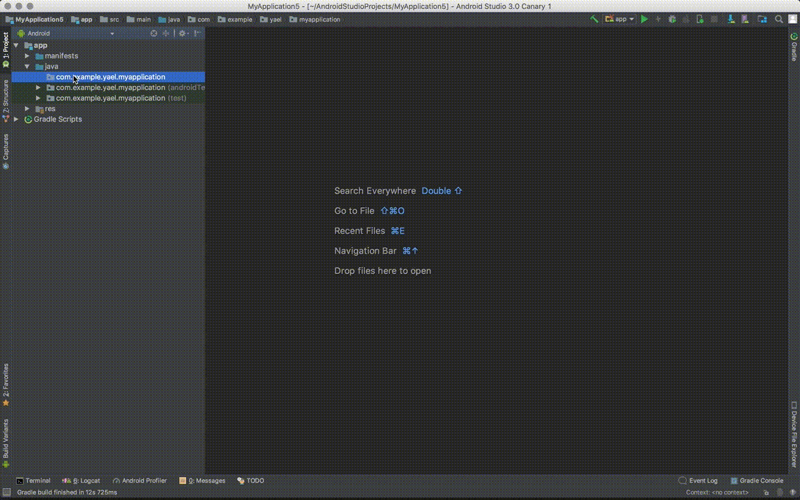

# App Intro

## What is this template?

The template implements the [AppIntro library activity][1]. It creates
the class, you can choose between the two different theme available in the library.
It also create strings arrays for the titles and the descriptions of the slides.
The template updates the Android Manifest to add the class.

[1]: https://github.com/apl-devs/AppIntro