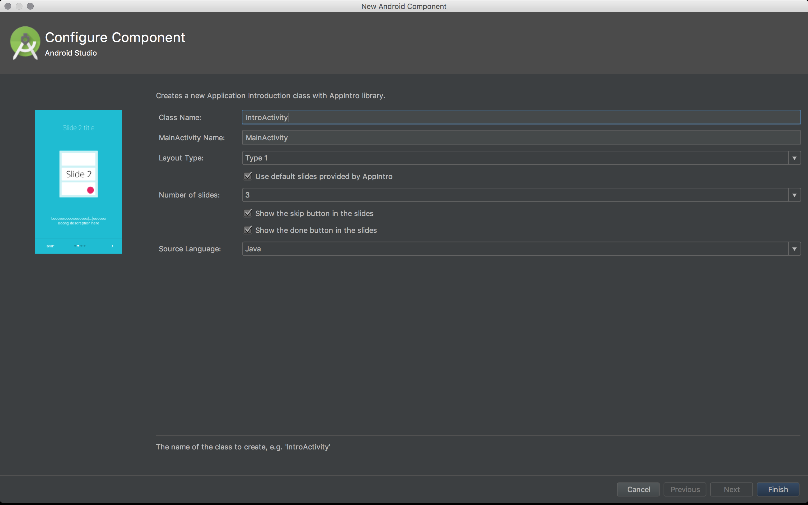

# Android Studio Templates



The template implements the [AppIntro library activity][1].  
The template is used to:
- create the class of the Intro Activity
- create the class of the Main Activity
- add the 2 class in the Android Manifest
- add launcher for the Main Activity in the Android Manifest
- create an array of Strings for the titles of the slides (arrays.xml)
- create an array of Strings for the descriptions of the slides (array.xml)


## Install

To install a template in your installation of Android Studio, you can download
the repository. You will find 2 templates inside the "template" folder. You can copy the one corresponding to your Android Studio version. If you have any doubt, choose Android Studio 2.

Copy the folder in the following directory.

```
AndroidStudioInstallationFolder/plugins/android/lib/templates/other/
```
Example for Windows:
```
C:/Program Files/Android/Android Studio/plugins/android/lib/templates/other/
```


## How to start a project with the template?

Once you copied the template files in the template folder of the Android Studio Application, restart Android Studio.
You can create a project using AppIntro quickly with the template provided.  

Create a new project with no activity.  
In the main folder, right click -> new -> App Intro -> App Intro  
You will see the template window, you can enter the name of the Intro Activity and the name of the Main Activity.  
Those activities should not already exist. You have the choice between the type of slides that you want,the number of slides, etc...  

**Add the JitPack repository to your build file**  
Add it in your root build.gradle at the end of repositories:
```gradle
	allprojects {
		repositories {
			...
			maven { url 'https://jitpack.io' }
		}
	}
```

Notes: The templates are available in both Java and Kotlin. Make sure to use the correct template based on the version of your Android Studio. If you are using Android Studio 3.0 Canary, you need to use the Android Studio 3 template files.

[1]: https://github.com/apl-devs/AppIntro

